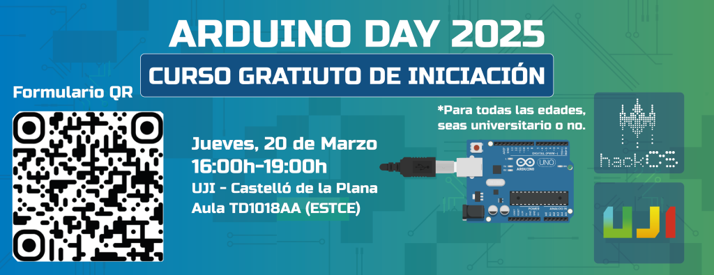

### ARDUINO DAY 2025

Celebrarem l'[Arduino Day](https://days.arduino.cc/about) realitzant un curs d'iniciació gratuït el Dijous 20 de Març de 2025.

  
<strong>INFORMACIÓ I INSCRIPCIÓ AL CURS</strong>

  Data: **dijous 20/03**

  Lloc: [UJI](https://www.google.es/maps/place/Universitat+Jaume+I/@39.9902105,-0.0511631,14z/data=!4m6!3m5!1s0xd5ffe0fca9b5147:0x1368bf53b3a7fb3f!8m2!3d39.9943481!4d-0.0702147!16zL20vMDg0dGNk?coh=164777&entry=tt&shorturl=1)

  En el curs s'ensenyarà l'estructura bàsica de l'Arduino, l'ús dels seus pins GPIO i dels pins analògics. Així mateix, es realitzaran projectes de forma pràctica per experimentar com funciona l'Arduino.

Es farà a l'**Aula TD1018AA** de **16-19h**. 

**IMPORTANT: És necessari portar ordinador portàtil amb l'Arduino IDE instal·lat.**

  
  Enllaç per inscriure's: https://forms.gle/fayBGnjUVXNkvHoZ8 

  
<strong>ENLLAÇ A LA PRESENTACIÓ</strong>

