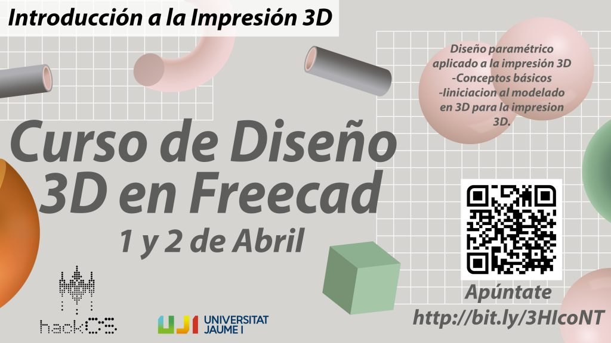

### CURS DE DISSENY 3D FREECAD

Realitzarem un [curs](bit.ly/3HIcoNT) en què ensenyarem a dissenyar i imprimir una peça en 3D amb FreeCAD des de zero, a la [UJI](https://www.google.es/maps/place/Universitat+Jaume+I/@39.9902105,-0.0511631,14z/data=!4m6!3m5!1s0xd5ffe0fca9b5147:0x1368bf53b3a7fb3f!8m2!3d39.9943481!4d-0.0702147!16zL20vMDg0dGNk?coh=164777&entry=tt&shorturl=1) els dies 1 i 2 d'Abril de 2022.

