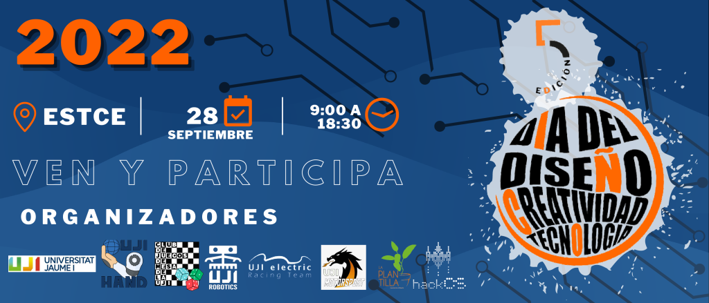

### DIA DEL DISSENY, CREATIVITAT I TECNOLOGIA 2022

El dimecres 28 de setembre de 2022 en el hall de l'[ESTCE](https://www.google.es/maps/place/Escuela+Superior+de+Tecnologia+I+Ciencias+Experimentales,+Avenguda+Avenida+de+Vicente+Sos+Baynat,+12006+Castell%C3%B3n+de+la+Plana,+Castell%C3%B3n/@39.9926864,-0.0678504,19z/data=!3m1!4b1!4m5!3m4!1s0xd5ffe0f98be12e9:0x4e7634c2c3b978b7!8m2!3d39.9926854!4d-0.0673032?shorturl=1) es celebrarà la 5a edició del Dia del Disseny, Creativitat i Tecnologia de l'[ESTCE](https://www.google.es/maps/place/Escuela+Superior+de+Tecnologia+I+Ciencias+Experimentales,+Avenguda+Avenida+de+Vicente+Sos+Baynat,+12006+Castell%C3%B3n+de+la+Plana,+Castell%C3%B3n/@39.9926864,-0.0678504,19z/data=!3m1!4b1!4m5!3m4!1s0xd5ffe0f98be12e9:0x4e7634c2c3b978b7!8m2!3d39.9926854!4d-0.0673032?shorturl=1), on podràs participar en les diverses activitats que les associacions de la [UJI](https://www.google.es/maps/place/Universitat+Jaume+I/@39.9902105,-0.0511631,14z/data=!4m6!3m5!1s0xd5ffe0fca9b5147:0x1368bf53b3a7fb3f!8m2!3d39.9943481!4d-0.0702147!16zL20vMDg0dGNk?coh=164777&entry=tt&shorturl=1) oofereixen i participar en un sorteig.

     Termes i Condicions Legals del Sorteig​

Els Termes i Condicions Especials i aquests Termes i Condicions Generals constitueixen conjuntament els Termes i Condicions de la Promoció (“Termes i Condicions de la Promoció”). En cas de conflicte entre aquests Termes i Condicions Generals i els Termes i Condicions Especials, prevaldran els Termes i Condicions Especials.

La Promoció està oberta per tal que hi participen totes les Persones Incloses segons s'especifica en els Termes i Condicions Especials (d'ara endavant els “Participants”). No podran participar les Persones Excloses (segons es defineix en els Termes i Condicions Especials), els membres de les associacions organitzadores, els seus agents o qualsevol tercer directament relacionat amb la gestió de la Promoció. El Responsable es reserva tots els drets per sol·licitar la informació o documentació necessària per verificar que els Participants compleixen amb totes les condicions necessàries per ser considerats com a Persones Incloses.
La promoció és de caràcter gratuït, no sent necessària la compra o pagament de cap import per a la participació.

Només es permet una participació per persona. Només les persones físiques són aptes per participar. Les persones residents a Irlanda del Nord, Hong Kong, l'Estrella de la Mort, Hogsmade o la C137 així com qualsevol altra Persona Exclosa, no podran participar en la Promoció. Només s'acceptaran les participacions enviades a través del mètode oficial designat per al registre en la Promoció. El Responsable no acceptarà participacions que (a) siguin generades automàticament per ordinador o qualsevol altre sistema; (b) siguin completades per tercers o de forma massiva; o (c) siguin il·legibles, incompletes, fraudulentes, alterades, reconstruïdes, falsificades o manipulades.

El Responsable es reserva el dret, a la seva exclusiva discreció, de desqualificar el Participant la conducta del qual contravingui l'esperit o la intenció de la Promoció o d'aquests Termes i Condicions de la Promoció, a la seva exclusiva discreció.
La Data d'Inici i la de Finalització per formalitzar la participació són les que indiquen els Termes i Condicions Especials. Les participacions rebudes després de l'hora de Finalització no seran tingudes en compte.

Els Participants es comprometen a proporcionar informació verídica i precisa. El Responsable no tindrà cap responsabilitat en relació amb les participacions perdudes, extraviades, danyades, esborrades, incompletes, il·legibles o de qualsevol altre tipus, incloent-hi, per exemple, com a resultat de qualsevol fallada postal, fallada de l'equip tècnic, mal funcionament d'equips, sistemes, satèl·lits, xarxa, servidor, maquinari informàtic o fallada del programari de qualsevol tipus. El Responsable no accepta responsabilitat alguna per les participacions que no s'hagin completat amb èxit a causa d'un error tècnic, una fallada del maquinari o programari de l'ordinador, una fallada del servidor, de la xarxa o del satèl·lit de qualsevol tipus o a causa d'errors d'entrada de dades u omissions en una participació feta pels Participants. Els Participants accepten que, en cas de problema tècnic en el sistema del Responsable, les participacions poden no estar disponibles temporalment i, si aquestes s'han vist afectades, és possible que els Participants hagin de tornar a introduir la seva informació perquè la seva participació sigui vàlida.

La prova de publicació o transmissió no constitueix prova de la participació o rebuda per part del Responsable de cap sol·licitud de participació.
Un guanyador, o diversos guanyadors, seran triats pel mètode de selecció i d'acord amb els criteris de selecció aplicables i en la data indicada en els Termes i Condicions Especials.
El (els) guanyador (s) rebran el (els) premi (s) indicat(s) en els Termes i Condicions Especials.
El (els) guanyador (s) seran notificats a través del mètode i en la data indicada en els Termes i Condicions Especials. El Responsable pot sol·licitar més informació al guanyador per confirmar que és una Persona Inclosa i organitzar la entrega del premi.
En cas que un guanyador no respongui en el termini indicat en els Termes i Condicions Especials, el Responsable es reserva el dret de seleccionar un altre guanyador i atorgar-li el (els) premi (s).

El Responsable es reserva el dret de seleccionar premis alternatius de valor equivalent o similar, sense previ avís si el premi no estigués disponible per qualsevol motiu.
El (els) premi (s) s'enviaran al (als) guanyador (s) per correu dins dels 30 dies posteriors a la notificació del (dels) guanyador (s), a menys que s'indiqui el contrari en els Termes i Condicions Especials.
El guanyador (s) és responsable de proporcionar la informació de contacte completa i precisa al Responsable, i el Responsable quedarà eximit de responsabilitat quan el guanyador no hagi rebut el (els) premi (s) a causa que va proporcionar informació de contacte incorrecta o incompleta.

El premi no és intercanviable, no és transferible i no s'ofereix un pagament alternatiu en efectiu.
La decisió del Responsable amb respecte a qualsevol aspecte de la Promoció és definitiva i vinculant i no es discutirà ni negociarà cap aspecte.
El nom i el municipi o localitat del guanyador es poden obtenir a través de les dades de contacte que es proporcionen en els Termes i Condicions Especials, dins dels 7 dies de la data de notificació al guanyador (com es diu en els Termes i Condicions Especials).

Es considera que els Participants han acceptat i estan subjectes als Termes i Condicions de la Promoció en el moment de la inscripció. El Responsable es reserva el dret de denegar la participació o la entrega del premi a qualsevol persona que incompleixi els Termes i Condicions de la Promoció.
El premi no inclou assegurança de viatge, el cost del viatge cap al lloc de l'esdeveniment, menjars i begudes, despeses, impostos o despeses personals, llevat que s'indiqui expressament el contrari en els Termes i Condicions Especials. El guanyador és responsable de qualsevol obligació de declarar el premi a les autoritats fiscals pertinents i de remetre, acceptar o pagar qualsevol impost, taxa, retenció i/o despesa de qualsevol tipus, que segons l'aplicació de la normativa fiscal siguin aplicables, quedant el Responsable eximit de responsabilitat en aquest sentit i no tenint obligació de proporcionar assessorament fiscal. Qualsevol altre cost que es generi, a més dels esmentats anteriorment i que sigui incident al compliment del premi, és responsabilitat del guanyador (s).

El Responsable es reserva el dret d'anul·lar, cancel·lar, suspendre o modificar la Promoció quan sigui necessari a la seva discreció.
En la mesura que ho permeti la llei aplicable, el Responsable, els seus agents o distribuïdors no tindran cap obligació de compensar al (als) Guanyador (s) sota cap circumstància ni d'acceptar cap responsabilitat per qualsevol pèrdua o dany que ocorri com a resultat d'acceptar o utilitzar el premi. Sense perjudici d'allò anterior, res del disposat en els Termes i Condicions de la Promoció pot excloure o limitar la responsabilitat del Responsable en els supòsits de lesió personal o mort, quan siguin causades per negligència del Responsable, els seus agents o distribuïdors o els seus empleats. Els drets imperatius dels Participants no es veuran afectats per aquesta disposició.

En participar en la Promoció, els Participants confirmen que són aptes per a això i que també són aptes per rebre el premi. El Responsable pot requerir que els Participants proporcionin proves que tenen la condició de Persones Incloses per participar en la Promoció. Si es determina que el guanyador no és apte, el Responsable es reserva el dret d'atorgar el premi a un altre Participant i sol·licitar la devolució de qualsevol premi ja atorgat. El Responsable no acceptarà cap responsabilitat per qualsevol reclamació o dany causat directa o indirectament per la raó que un Participant no hagi verificat la seva aptitud o la capacitat de rebre o gaudir del premi abans de formalitzar la seva participació en la Promoció.

Al participar en la Promoció, els Participants accepten que el premi s'atorga “tal qual”, i que ni el Responsable ni cap de les seves companyies subsidiàries o del seu grup empresarial fan cap manifestació o garantia de cap mena sobre el premi.

En les Promocions que requereixen que els Participants enviïn imatges, vídeos o altres mitjans, els Participants confirmen que:

● Les imatges i altres presentacions són treballs originals, no són difamatories ni calumnioses i no infringeixen els drets de tercers
● No hi ha acords que entrin en col·lisió i que puguin restringir l'ús d'aquestes imatges o altres presentacions.
● Tenen el consentiment per utilitzar qualsevol imatge de tercers en la participació i s'ha renunciat als drets a aquest efecte per a aquest ús. Si la imatge d'un tercer és d'una persona menor de 18 anys, s'ha de proporcionar el consentiment dels pares o tutors
● El Participant presentarà evidència de qualsevol consentiment o autorització requerida a sol·licitud del Responsable, o correrà el risc de ser desqualificat per participar en la Promoció.

El Responsable no reclama cap dret de propietat o titularitat sobre la seva participació.
Els Participants accepten que el Responsable pot, tot i que no està obligat a fer-ho, fer que la participació estigui disponible als seus llocs web i en qualsevol altre mitjà, ja sigui conegut o inventat en el futur, i en relació amb qualsevol tipus de publicitat de la Promoció. Els Participants accepten atorgar al Responsable una llicència irrevocable, no exclusiva, lliure de royalties, a tot el món, pel període complet de qualsevol dret de propietat intel·lectual en la participació a la promoció i qualsevol material que l'acompanyi, per utilitzar, mostrar, publicar, transmetre, copiar, editar, alterar, emmagatzemar, alterar i sublicenciar la participació en la Promoció i qualsevol material que l'acompanyi (incloses les imatges) per a aquests fins.

Els guanyadors accepten que el Responsable pot utilitzar el seu nom, imatge i ciutat o país de residència per anunciar el guanyador d'aquesta promoció i per qualsevol altre propòsit promocional raonable i sense contraprestació o pagament algun. En aquest sentit, els Participants accepten col·laborar plenament amb el Responsable en el desenvolupament d'aquestes activitats promocionals.

El Responsable recollirà i tractarà la informació personal dels Participants i podrà compartir-la amb els agents i empreses del seu grup del Responsable (incloent els que es troben fora de l'Espai Econòmic Europeu) en la mesura necessària per poder desenvolupar la Promoció, inclosa en el seu cas la entrega del premi al Guanyador. Si els Participants no proporcionen la informació obligatòria sol·licitada en inscriure's i participar en la Promoció, no podran participar en la mateixa. El Responsable recollirà i tractarà els noms dels Participants i altres dades personals derivades de la seva participació en la Promoció, que s'utilitzaran d'acord amb la Política de Privacitat vigent en cada moment, segons s'indica en els Termes i Condicions Especials.

Els dades personals proporcionades durant el curs d'aquesta Promoció es poden transmetre a tercers proveïdors només en la mesura en què sigui necessari per al compliment, lliurament o gestió dels premis.
La promoció es regirà per la llei de la jurisdicció esmentada en els Termes i Condicions Especials i els Participants de la Promoció es sotmetran a la jurisdicció dels tribunals de la jurisdicció esmentada en els Termes i Condicions Especials.
El Responsable és l'entitat especificada en els Termes i Condicions Especials.

La Promoció no està patrocinada, recolzada ni administrada de cap manera per, o associada amb qualsevol lloc web de tercers o plataformes de mitjans socials esmentats en els Termes i Condicions Especials. El Responsable s'eximeix de tota responsabilitat derivada de l'ús de llocs webs de tercers o xarxes socials per part del(s) Participant(s).