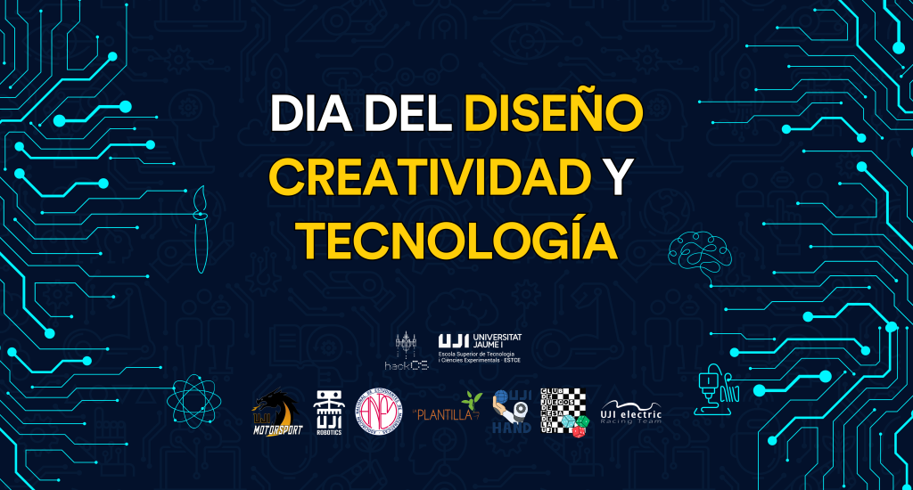

### Dia del Disseny, Creativitat i Tecnologia 2023

El dijous 28 de setembre de 2023, al hall de l'[ESTCE](https://www.google.es/maps/place/Escuela+Superior+de+Tecnologia+I+Ciencias+Experimentales,+Avenguda+Avenida+de+Vicente+Sos+Baynat,+12006+Castell%C3%B3n+de+la+Plana,+Castell%C3%B3n/@39.9926864,-0.0678504,19z/data=!3m1!4b1!4m5!3m4!1s0xd5ffe0f98be12e9:0x4e7634c2c3b978b7!8m2!3d39.9926854!4d-0.0673032?shorturl=1) es celebrarà la 6a edició del Dia del Disseny, Creativitat i Tecnologia de l'[ESTCE](https://www.google.es/maps/place/Escuela+Superior+de+Tecnologia+I+Ciencias+Experimentales,+Avenguda+Avenida+de+Vicente+Sos+Baynat,+12006+Castell%C3%B3n+de+la+Plana,+Castell%C3%B3n/@39.9926864,-0.0678504,19z/data=!3m1!4b1!4m5!3m4!1s0xd5ffe0f98be12e9:0x4e7634c2c3b978b7!8m2!3d39.9926854!4d-0.0673032?shorturl=1), on podràs participar en diverses activitats que les associacions de la [UJI](https://www.google.es/maps/place/Universitat+Jaume+I/@39.9902105,-0.0511631,14z/data=!4m6!3m5!1s0xd5ffe0fca9b5147:0x1368bf53b3a7fb3f!8m2!3d39.9943481!4d-0.0702147!16zL20vMDg0dGNk?coh=164777&entry=tt&shorturl=1) ofereixen i participar en un sorteig.

    Tèrmits i Condicions Legals del Sorteig

Els Tèrmits i Condicions Especials i aquests Tèrmits i Condicions Generals constitueixen conjuntament els Tèrmits i Condicions de la Promoció (“Tèrmits i Condicions de la Promoció”). En cas de conflicte entre aquests Tèrmits i Condicions Generals i els Tèrmits i Condicions Especials prevaldran els Tèrmits i Condicions Especials.

La Promoció està oberta per tal que hi participen totes les Persones Incloses segons es specifica als Tèrmits i Condicions Especials (en endavant els “Participants”).

No podran participar les Persones Excloses (segons es defineixen als Tèrmits i Condicions Especials), els membres de les associacions organitzadores, els seus agents o qualsevol tercer directament relacionat amb la gestió de la Promoció. El Responsable es reserva tots els drets per sol·licitar la informació o documentació necessària per verificar que els Participants compleixen amb totes les condicions necessàries per ser considerats una Persona Inclosa.

La promoció és de caràcter gratuït no sent necessària la compra o pagament d’importa algun per la participació.

Només es permet una participació per persona. Només les persones físiques són aptes per participar. Les persones residents al Nord d’Irlanda, Hong Kong, l’Estrella de la Mort, Hogsmeade o la C137 així com qualsevol altra Persona Exclosa no podran participar a la Promoció. Només s’acceptaran les participacions enviades a través del mètode oficial designat per al registre a la Promoció. El Responsable no acceptarà participacions que (a) siguin generades automàticament per ordinador o qualsevol altre sistema; (b) siguin completades per tercers o de forma massiva; o (c) siguin il·legibles, incompletes, fraudulentes, alterades, reconstruïdes, falsificades o manipulades.

El Responsable es reserva el dret, a la seva discreció, de desqualificar el Participant la conducta del qual contravingui l’esperit o la intenció de la Promoció o d’aquests Tèrmits i Condicions de la Promoció.

La Data d’Inici i la de Finalització per formalitzar la participació són l’hora d’inici de l’esdeveniment i l’hora de finalització de l’esdeveniment respectivament. Les participacions rebudes després de l’hora de Finalització no seran tingudes en compte.

Els Participants es comprometen a proporcionar informació veraç i precisa. El Responsable no tindrà responsabilitat alguna pel que fa a participacions perdudes, extraviades, danyades, esborrades, incompletes, il·legibles o d’una altra manera impossibles de llegir o retardades en la seva entrega, independentment de la causa, incloent, per exemple, com a resultat de qualsevol fallada postal, fallada de l’equip tècnic, mal funcionament d’equips, sistemes, satèl·lits, xarxes, servidors, maquinari informàtic o fallada de programari de qualsevol tipus. El Responsable no accepta responsabilitat alguna per les participacions que no s’hagin completat amb èxit a causa d’un fallada tècnica, un fallada del maquinari o programari de l’ordinador, un fallada del servidor, de la xarxa o del satèl·lit de qualsevol tipus o a causa d’errors d’entrada de dades o omissions en una participació feta pels Participants. Els Participants accepten que, en cas de problema tècnic al sistema del Responsable, les participacions poden no estar disponibles temporalment i, si aquestes s’han vist afectades, és possible que els Participants hagin de tornar a introduir la seva informació perquè la seva participació sigui vàlida.

La prova de publicació o transmissió no constitueix prova de la participació o recepció per part del Responsable de cap sol·licitud de participació.

Un guanyador, o diversos guanyadors, seran escollits pel mètode de selecció i d’acord amb els criteris de selecció aplicables i en la data indicada als Tèrmits i Condicions Especials.

Els guanyadors seran notificats a través del mètode i en la data indicada als Tèrmits i Condicions Especials. El Responsable pot sol·licitar més informació al guanyador per confirmar que és una Persona Inclosa i organitzar l’entrega del premi.

En cas que un guanyador no respongui en el termini indicat als Tèrmits i Condicions Especials, el Responsable es reserva el dret de seleccionar un altre guanyador i atorgar-li el premi o deixar el premi desert.

El Responsable es reserva el dret de seleccionar premis alternatius de valor equivalent o similar, sense previ avís si el premi no estigués disponible per qualsevol motiu.

El guanyador és responsable de proporcionar la informació de contacte completa i precisa al Responsable, i el Responsable quedarà eximit de responsabilitat quan el guanyador no hagi rebut el premi a causa de la informació de contacte incorrecta o incompleta.

El premi no és intercanviable, no és transferible i no es proporciona cap pagament alternatiu en efectiu.

La decisió del Responsable respecte a qualsevol aspecte de la Promoció és definitiva i vinculant i no es discutirà ni negociarà.

Es considera que els Participants han acceptat els Tèrmits i Condicions de la Promoció en el moment de la inscripció. El Responsable es reserva el dret de denegar la participació o l’entrega del premi a qualsevol persona que incompleixi els Tèrmits i Condicions de la Promoció.

El premi no inclou assegurança de viatge, el cost del viatge cap i des del lloc de l’esdeveniment, menjars i begudes, despeses, impostos o despeses personals, llevat que s’indique expressament el contrari als Tèrmits i Condicions Especials. El guanyador és responsable de qualsevol obligació fiscal relativa al premi.

Els Participants accepten que el Responsable pot usar el seu nom, imatge i ciutat o país de residència per anunciar el guanyador d’aquesta promoció i per a qualsevol altre propòsit promocional raonable i sense contraprestació o pagament. Els Participants acorden col·laborar plenament amb el Responsable en el desenvolupament d’aquestes activitats promocionals.

Els Participants accepten que les seves dades personals siguin tractades d’acord amb la Política de Privacitat i es comparteixin amb agents o empreses associades al Responsable per tal de gestionar la Promoció.

La promoció es regirà per la llei de la jurisdicció indicada als Tèrmits i Condicions Especials i els Participants es sotmetran a la jurisdicció dels tribunals d’aquesta jurisdicció.

Tèrmits i Condicions Especials:

    Mètode de selecció del guanyador: Aleatori a través d’una pàgina web similar a random.org.

    Plazo previst per a la selecció del guanyador: 10 dies hàbils des de la finalització de la recollida de participacions.

    Mètode de notificació del guanyador: Correu electrònic.

    Plazo previst per a la notificació del guanyador: 12 dies hàbils des de la finalització de la recollida de participacions.

    Plazo límit per a la resposta a la notificació del guanyador: 10 dies hàbils des de la data de la notificació.

Espero que aquesta versió en valencià sigui útil.