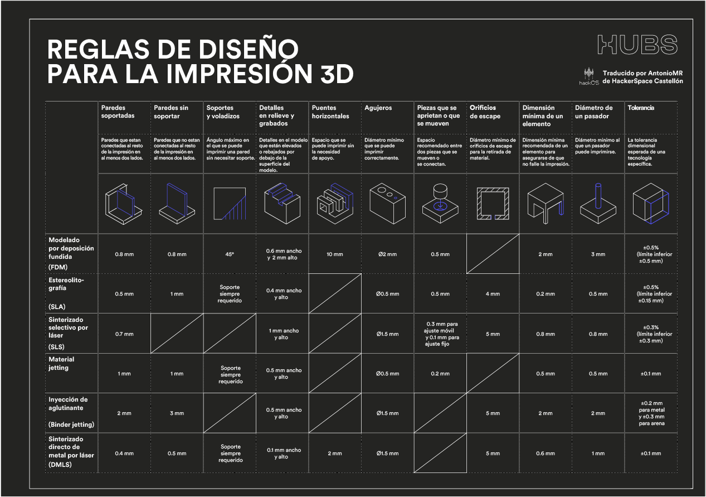

## **Microcurs: "Impressió 3D: Laminat amb Prusa Slicer i modelatge paramètric amb Onshape"**

## <a href="https://drive.google.com/uc?export=download&id=1mlRjIqN3Ekz0S_hKNkAyMb6zL-g_hNtw">**ENLLAÇ A LA PRESENTACIÓ (PDF)**</a>

## <a href="https://drive.google.com/uc?export=download&id=1mo-i57dWZJebl93xp9KAShWu8m0BywMb">**ENLLAÇ A LA PRESENTACIÓ 2 (PDF)**</a>

## <a href="https://drive.google.com/uc?export=download&id=1qPdpedg98qHknJdK3PokTFnIpCuVHcyJ">**ENLLAÇ A LA PRESENTACIÓ 3 (PDF)**</a>

<figure>

<figcaption>

Regles de Disseny per a la Impressió 3D

</figcaption>

</figure>
