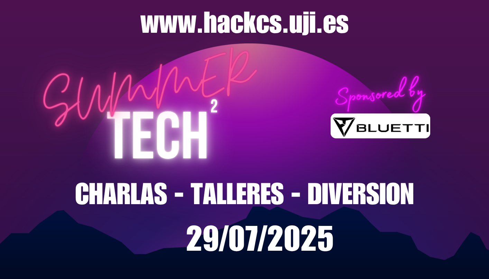

### SUMMER TECH 2025

El dimarts 29 de 2025, al pinar, es celebrará la SUMMERTECH 2025.

> ¡ATENCIÓ!
> La ubicació de l'esdeveniment ha canviat a causa de les condicions meteorològiques, i s'ha contactat amb tots els convidats. Si no has rebut un missatge, si us plau, posa't en contacte amb l'organització.

#### Informació i Inscripció

Data: **dimarts 29/07/2025**
Lloc: [El Pinar](https://www.google.com/maps?client=ubuntu&hs=G6J&sca_esv=eddefdb7b92e7545&channel=fs&kgmid=/g/11bxg2l97q&shndl=30&shem=lcuae,uaasie&kgs=a881b2cbc5c48ba7&um=1&ie=UTF-8&fb=1&gl=pt&sa=X&geocode=KUmmJxf1_58SMYXc8woisREW&daddr=Av.+de+Ferrandis+Salvador,+10,+12100+Grau+de+Castell%C3%B3,+Castell%C3%B3,+Espa%C3%B1a)

Assistiu al Summer Tech, un esdeveniment amb tallers i xerrades sobre tecnologia i el món *open source*. Gaudeu d'un entorn natural únic i menjar mentre aprenc i us connecteu amb experts i entusiastes. Reserveu el vostre lloc i viu aquesta experiència única.

L'esdeveniment està patrocinat per [BLUETTI](https://www.google.com/url?sa=t&source=web&rct=j&opi=89978449&url=https://es.bluettipower.eu/%3Fsrsltid%3DAfmBOoql5f6pGZSlDPstaFGDkUotrQV6M5-Oui8Tt_y8ukrrPLGzkjIl&ved=2ahUKEwjH4cjDh-WOAxVWK_sDHfpPJyIQFnoECA0QAQ&usg=AOvVaw1e-4iRJGFVuTiH2HTzULr0), gràcies als seus panells solars i estació de càrrega portàtils, podrem gaudir d'energia *off-grid* durant tot l'esdeveniment. L'esdeveniment és una demostració de com és possible gaudir i cuidar de l'entorn al mateix temps.

**IMPORTANT: És necessari portar-se cadira propia.**

Enllaç per inscriure's (abans del 20 de juliol): [https://docs.google.com/forms/d/e/1FAIpQLSfb5iP1xNn3G1thgnAKKIxOocBk-4buWH80AhUkY7dfWnpy0A/viewform](https://docs.google.com/forms/d/e/1FAIpQLSfb5iP1xNn3G1thgnAKKIxOocBk-4buWH80AhUkY7dfWnpy0A/viewform)

 
