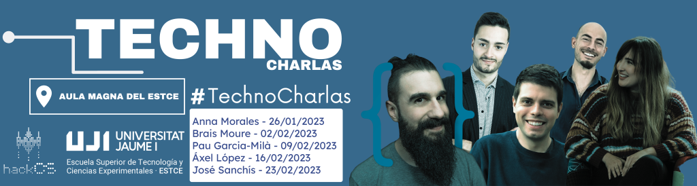

### TECHNOCHARLAS UJI 2023

Hem organitzat unes xerrades amb experts sobre diversos temes a les quals es podrà assistir tant presencialment a l'[Aula Magna](https://www.google.es/maps/place/Escuela+Superior+de+Tecnologia+I+Ciencias+Experimentales,+Avenguda+Avenida+de+Vicente+Sos+Baynat,+12006+Castell%C3%B3n+de+la+Plana,+Castell%C3%B3n,+Espa%C3%B1a/@39.9926198,-0.0676889,18z/data=!3m1!5s0xd5ffe0f98d8e357:0x79b3d77cb1bdb39f!4m6!3m5!1s0xd5ffe0f98be12e9:0x4e7634c2c3b978b7!8m2!3d39.9926854!4d-0.0673032!16s%2Fg%2F1hhx08l_l?entry=ttu&g_ep=EgoyMDI1MDMzMC4wIKXMDSoASAFQAw%3D%3D) de la [UJI](https://www.google.es/maps/place/Universitat+Jaume+I/@39.9902105,-0.0511631,14z/data=!4m6!3m5!1s0xd5ffe0fca9b5147:0x1368bf53b3a7fb3f!8m2!3d39.9943481!4d-0.0702147!16zL20vMDg0dGNk?coh=164777&entry=tt&shorturl=1) com virtualment a través d'un enllaç de Google Meet.

 

\[ACCES ONLINE + INFO\] “Parlant sobre Nanotecnologia” - Anna Morales

Data: **dijous 26/11, 11:00h**.

Lloc: telemàtica (emesa en directe a l'**Aula Magna de l'ESTCE**):

**https://meet.google.com/kgq-ymgx-ose**

Experta: **Anna Morales** (Univ. de Basilea — Suïssa).

La xerrada serà de 45-60 min + ~30 min de debat obert.

L'assistència completa al cicle convalida per 0,5 crèdits d'estudis per a l'estudiantat de grau.

Sobre la ponent: Nanotecnòloga i investigadora a la Universitat de Basilea (Suïssa). A més, és divulgadora científica a través del seu canal de YouTube, **SizeMatters**. Anna és estudiant de màster en Ciències dels Materials i enginyeria a l'École Polytechnique Fédérale de Lausanne (EPFL), amb un gran interès en la investigació de les ciències dels materials, especialment en la microscòpia electrònica.

\[ACCES ONLINE + INFO\] “La Senda del Freelance” - Brais Moure

Data: **dijous 02/02, 11:00h.**

Lloc: [Aula Magna de l'ESTCE]

**https://meet.google.com/kgq-ymgx-ose**

Expert: **Brais Moure** (Programador i divulgador)

La xerrada serà de 45-60 min + ~30 min de debat obert.

L'assistència completa al cicle convalida per 0,5 crèdits d'estudis per a l'estudiantat de grau.

Sobre el ponent: Programador i divulgador, ha participat a la TarugoConf22, a la PlatziConf i altres conferències de renom, a més de fer un vídeo a la WWDC d'Apple. Sota la seva responsabilitat es troben diverses apps i plataformes que utilitzem cada dia i els seus projectes personals compten amb més de 2 milions de descàrregues.

\[ACCES ONLINE + INFO\] “L'Aventura d'una Idea” - Pau Garcia-Milà

Data: **dijous 09/02, 11:30h.**

Lloc: Aula Magna de l'ESTCE

**https://meet.google.com/kgq-ymgx-ose**

Expert: **Pau Garcia-Milà**

La xerrada serà de 45-60 min + ~30 min de debat obert.

L'assistència completa al cicle convalida per 0,5 crèdits d'estudis per a l'estudiantat de grau.

Sobre el ponent: Emprenedor en l'àrea tecnològica, guanyador d'un premi de la fundació Princesa d'Astúries, d'un premi de la universitat de Cambridge, altres premis del MIT… entre altres. La seva fama va començar quan als 17 anys va vendre la seva start-up a Telefónica. La seva compta de Tik Tok “Te lo cuento en un minuto” supera el milió de seguidors.

\[ACCES ONLINE + INFO\] “D'Enginyers a Emprenedors Socials” - Áxel López

Data: **dijous 16/02, 11:00h.**

Lloc: Aula Magna de l'ESTCE

**https://meet.google.com/kgq-ymgx-ose**

Expert: **Áxel López**

La xerrada serà de 45-60 min + ~30 min de debat obert.

L'assistència completa al cicle convalida per 0,5 crèdits d'estudis per a l'estudiantat de grau.

Sobre el ponent: Ex-estudiant de la UJI i emprenedor. Interessat en el món rural i la tecnologia, va cofundar Voluta.coop, una empresa que porta solucions modernes i tecnològiques al món rural. Guanyador del premi a l'emprenedoria pel Ministeri per a la Transició Ecològica i el Repte Demogràfic, actualment es dedica a organitzar hackathons i conscienciar les noves generacions sobre la importància del món rural.  

\[ACCES ONLINE + INFO\] “Parlant sobre Blockchain” - José Sanchís

Data: **dijous 23/02, 11:00h.**

Lloc: Aula Magna de l'ESTCE

**https://meet.google.com/kgq-ymgx-ose**

Expert: **José Sanchís**

La xerrada serà de 45-60 min + ~30 min de debat obert.

L'assistència completa al cicle convalida per 0,5 crèdits d'estudis per a l'estudiantat de grau.

Sobre el ponent: Cofundador d'una empresa de serveis informàtics, està actualment gestionant la publicació d'un llibre rigorós i tècnic (i alhora entretingut) sobre Bitcoin, ja que considera que el material existent actualment té moltes mancances, especialment pel que fa a rigor. Ha estudiat un curs obert del MIT sobre enginyeria i disseny de criptomonedes (amb coneixements fonamentals de Bitcoin).
