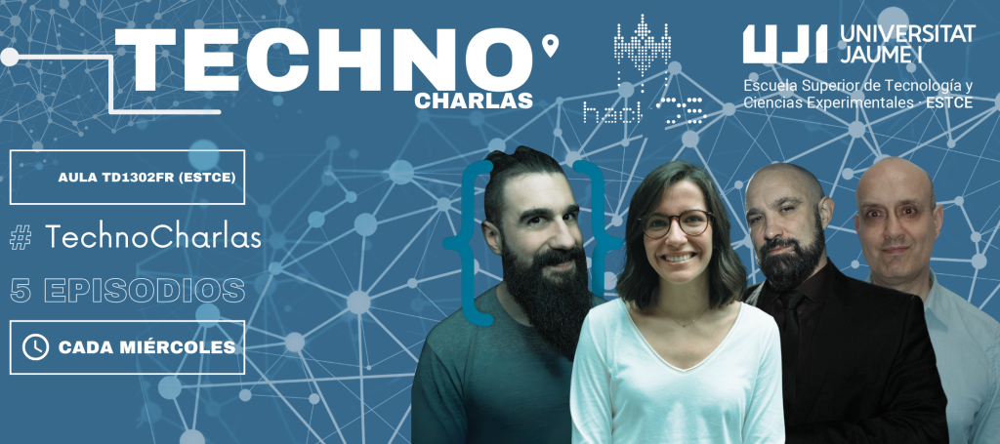

### TECHNOCHARLAS UJI 2024

Hem organitzat unes xerrades amb experts sobre diversos temes a les quals es podrà assistir tant presencialment a l'[Aula TD1302FR (ESTCE)](https://www.google.es/maps/place/TD0-301-CC,+12006+Castell%C3%B3n+de+la+Plana,+Castell%C3%B3n/@39.9926325,-0.0678082,19.42z/data=!3m1!5s0xd5ffe0f98fabe59:0x79b3d77c180eed05!4m5!3m4!1s0xd5ffe0f9f2933b5:0x47e8fe909104baff!8m2!3d39.9926435!4d-0.0674141?coh=164777&entry=tt&shorturl=1) com virtualment a través d'un enllaç de Google Meet.

    

\[ACCESO ONLINE + INFO\] “Emprenedoria Femenina en l'Àmbit Tecnològic” - Anna Cejudo - EP1

Data: **dimecres 21/02, 11:00h**.

Lloc: telemàtica (emesa en directe a l'**Aula TD1302FR ESTCE**)

**https://meet.google.com/thn-xpqb-bcn**

Experta: **Anna Cejudo Mercado**

La xerrada serà de 45-60 min + ~30 min de debat obert.  
L'assistència completa al cicle convalida per 0,5 crèdits d'estudis per a l'estudiantat de grau.

Sobre la ponent: destacada emprenedora i figura rellevant en el camp de la Intel·ligència Artificial. Juntament amb la seva parella, Pau García-Milà, ha creat Zeve, el primer robot dissenyat per mantenir converses, actuant com un guia educatiu personalitzat.

\[ACCESO ONLINE + INFO\] “Parlant sobre Ciberseguretat” - Antonio Fernandes - EP2

Data: **dimecres 28/02, 11:00h**.

Lloc: presencial a l'**Aula TD1302FR ESTCE**

**https://meet.google.com/thn-xpqb-bcn**

Expert: **Antonio Fernandes Vazquez**

La xerrada serà de 45-60 min + ~30 min de debat obert.  
L'assistència completa al cicle convalida per 0,5 crèdits d'estudis per a l'estudiantat de grau.

Sobre el ponent: És un hacker espanyol, expert en ciberseguretat amb una àmplia trajectòria en l'àmbit. És conegut per la seva tasca de divulgació, formació i consideració sobre la seguretat informàtica. És un reconegut _Bug Hunter_, havent trobat i reportat vulnerabilitats en importants empreses com Google, Facebook, Twitter, Uber, Microsoft, Intel, Apple, entre altres.

\[ACCESO ONLINE + INFO\] “13 Consells de Senior que donaria al meu jo de Junior” - Brais Moure - EP3

Data: **dimecres 13/03, 11:00h**.

Lloc: presencial a l'**Aula TD1302FR ESTCE**

**https://meet.google.com/thn-xpqb-bcn**

Expert: **Brais Moure**

La xerrada serà de 45-60 min + ~30 min de debat obert.  
L'assistència completa al cicle convalida per 0,5 crèdits d'estudis per a l'estudiantat de grau.

Sobre el ponent: Brais Moure, conegut com Mouredev, és un desenvolupador de programari freelance amb més de 12 anys d'experiència. Especialitzat en aplicacions iOS i Android, ha creat més de 40 aplicacions de petita i gran escala. A més de la seva feina com a desenvolupador, Mouredev també és creador de contingut educatiu, amb un canal de YouTube amb més de mig milió de subscriptors on ensenya sobre programació i desenvolupament d'apps.

\[ACCESO ONLINE + INFO\] “Parlant sobre IA” - Ismael Sanz - EP4

Data: **dimecres 20/03, 11:00h**.

Lloc: presencial a l'**Aula TD1302FR ESTCE**

**https://meet.google.com/thn-xpqb-bcn**

Expert: **Ismael Sanz**

La xerrada serà de 45-60 min + ~30 min de debat obert.  
L'assistència completa al cicle convalida per 0,5 crèdits d'estudis per a l'estudiantat de grau.

Sobre el ponent: Professor Titular de Universitat al departament d'Enginyeria i Ciència dels Computadors de la UJI. Anteriorment va treballar a l'empresa privada i a la Vrije Universiteit Brussel, Bèlgica. Pertany al grup de recerca TKBG, i els seus interessos inclouen el tractament de dades semi-estructurades i no estructurades, les tecnologies semàntiques i la recuperació de la informació. Ha dirigit diversos projectes de recerca i ha contribuit a revistes i congressos internacionals de gran impacte. És cofundador de l'empresa de base tecnològica SemanticBots.

\[ACCESO ONLINE + INFO\] Taula Rodona - EP5

Data: **dimecres 10/04, 11:00h**.

Lloc: presencial a l'**Aula TD1302FR ESTCE**

**https://meet.google.com/thn-xpqb-bcn**

Experts:

**Jose Bort** – CEO Eventcase i president de Xarxatec.

**Alexis Nadal** – CEO de Nayar Systems

**Victor Rueda** – Vicedirector del grau d'Enginyeria Industrial

**Javier Gasch** – Responsable de reclutament i selecció a Torrecid

El tema principal gira al voltant de l'emprenedoria, la divulgació científica i l'activació de la comunitat universitària.

\[ACCESO ONLINE + INFO\] "Mars 2020 Perseverance, del llançament a l'aterratge" - Fernando Abilleira - EP6

Data: **dimecres 08/05, 16:00h**.

Lloc: telemàtica (emesa en directe al **Saló d'Actes de la ESTCE**)

**https://meet.google.com/thn-xpqb-bcn**

Expert: **Fernando Abilleira**

La xerrada serà de 45-60 min + ~30 min de debat obert.  
L'assistència completa al cicle convalida per 0,5 crèdits d'estudis per a l'estudiantat de grau.

Sobre el ponent: Enginyer Aerospacial Superior, va començar la seva carrera professional al NASA Goddard Space Flight Center situat a Greenbelt, Maryland (USA), on va donar suport d'anàlisi i disseny de missió al James Webb Space Telescope, Hubble Space Telescope, Solar Dynamics Observatory i ST5 entre altres. A principis de 2004 va començar a treballar al NASA Jet Propulsion Laboratory situat a Pasadena, Califòrnia (USA) com a Analista de Trayectoria i Enginyer de Disseny de Missió per a l'Oficina del Programa d'Exploració de Mart. Fernando ha donat suport tècnic a múltiples missions i estudis que inclouen el Mars Telecommunications Orbiter, Mars Science Orbiter, Mars Netlanders, Mars Sample Return i altres estudis avançats, sent subdirector d'Operacions de Vol del Mars 2020 Perseverance des del llançament fins a l'aterratge amb èxit a l'interior del cràter Jezero a Mart el 18 de febrer de 2021. Actualment, Fernando dóna suport al projecte ExoMars Rosalind Franklin de l'ESA/NASA com a Director de Disseny de Missió de l'equip de la NASA. Aquesta missió té com a objectiu aterrar un rover a Mart no abans de 2030, que prendrà mostres del subsòl en la recerca de material orgànic.
