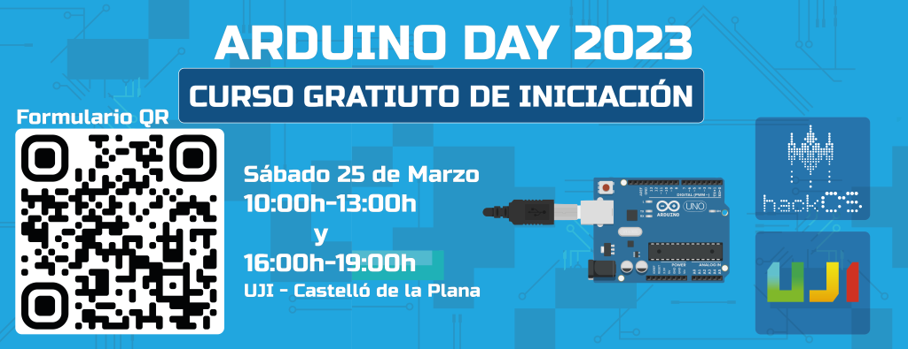

### ARDUINO DAY 2023

We will celebrate [Arduino Day](https://days.arduino.cc/about) by offering a free introductory course on Saturday, March 25, 2023.

  
<strong>COURSE INFORMATION AND REGISTRATION</strong>

  Date: **Saturday, 25/03**

  Location: [UJI](https://www.google.es/maps/place/Universitat+Jaume+I/@39.9902105,-0.0511631,14z/data=!4m6!3m5!1s0xd5ffe0fca9b5147:0x1368bf53b3a7fb3f!8m2!3d39.9943481!4d-0.0702147!16zL20vMDg0dGNk?coh=164777&entry=tt&shorturl=1)

  In the course, we will teach the basic structure of Arduino, the use of its GPIO pins, and analog pins. We will also carry out practical projects to experience how Arduino works.

  Two groups will be created: one in the morning from **10-14h** and another in the afternoon from **15-19h**. Each group will have about 10 people, based on the order of registration.

  **IMPORTANT: You need to bring a laptop with the Arduino IDE installed.**

  
  Registration link: https://forms.gle/v6hs5AMncxMhfBMW9

<strong>LINK TO THE PRESENTATION</strong>

