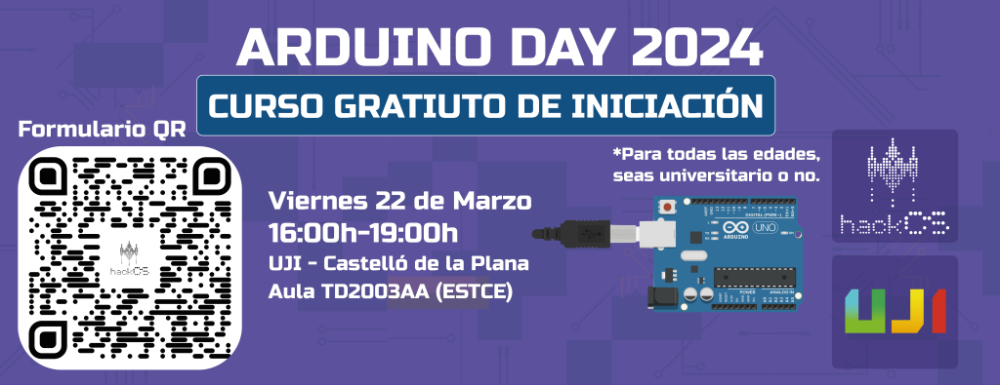

### ARDUINO DAY 2024

We will celebrate [Arduino Day](https://days.arduino.cc/about) by offering a free introductory course on Friday, March 22, 2024. 

  
<strong>COURSE INFORMATION AND REGISTRATION</strong>

  Date: **Friday, 22/03**

  Location: [UJI](https://www.google.es/maps/place/Universitat+Jaume+I/@39.9902105,-0.0511631,14z/data=!4m6!3m5!1s0xd5ffe0fca9b5147:0x1368bf53b3a7fb3f!8m2!3d39.9943481!4d-0.0702147!16zL20vMDg0dGNk?coh=164777&entry=tt&shorturl=1)

  In the course, we will teach the basic structure of Arduino, the use of its GPIO pins, and analog pins. We will also carry out practical projects to experience how Arduino works.

  It will take place in **Room TD2003AA** from **16:00 to 19:00**.

  **IMPORTANT: You need to bring a laptop with the Arduino IDE installed.**

  Registration link: [https://forms.gle/pxSX2cZt5j5hMYkG8](https://forms.gle/pxSX2cZt5j5hMYkG8)

  
<strong>LINK TO THE PRESENTATION</strong>

  
  
 <a href="https://docs.google.com/presentation/d/1fMmFWUism4sZHJ8vI0T2zIbY2hmfPhJat6D9yrf0pDY/edit?usp=sharing"> https://docs.google.com/presentation/d/1fMmFWUism4sZHJ8vI0T2zIbY2hmfPhJat6D9yrf0pDY/edit?usp=sharing </a>

  

