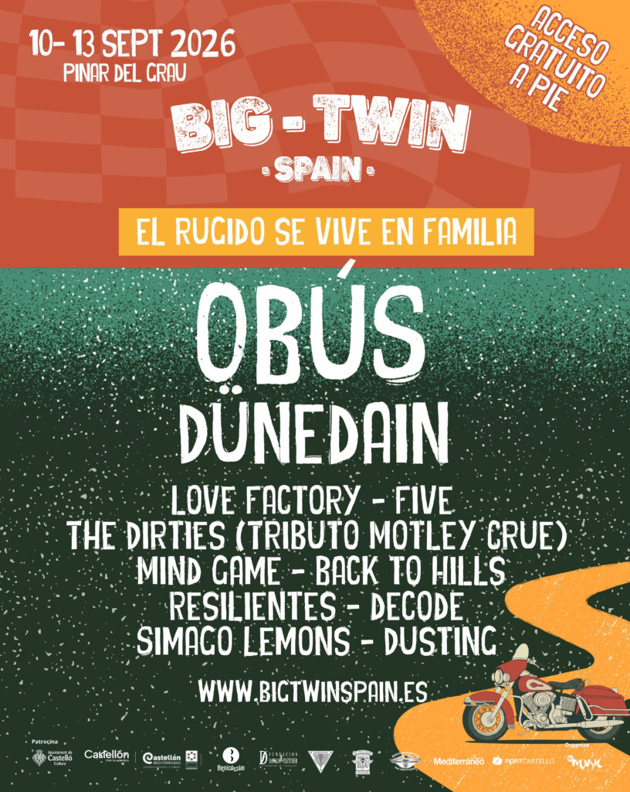

### BIG TWIN 2026

From September 10th to 13th, 2026, at the [Pinar del Grao in Castellón](https://www.google.es/maps/search/Pinar+del+Grao,+Castell%C3%B3n+de+la+Plana), a new edition of [Big Twin](https://bigtwinspain.es/) will be held, one of the longest-running motorcycle gatherings in the province. Under the motto "El rugido se vive en familia" (the roar is lived as a family), there will be four days of motorcycles, concerts, biker routes, food, a market, a bike show, a kids zone and workshops.

Walk-in access to the venue and all the concerts are free, with Obús and Dünedain headlining. Camping and motorcycle parking are booked separately.

