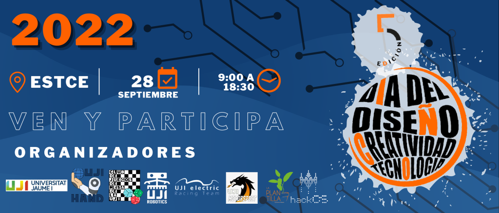

### DESIGN, CREATIVITY, AND TECHNOLOGY DAY 2022

On Wednesday, September 28th, 2022, in the [ESTCE](https://www.google.es/maps/place/Escuela+Superior+de+Tecnologia+I+Ciencias+Experimentales,+Avenguda+Avenida+de+Vicente+Sos+Baynat,+12006+Castell%C3%B3n+de+la+Plana,+Castell%C3%B3n/@39.9926864,-0.0678504,19z/data=!3m1!4b1!4m5!3m4!1s0xd5ffe0f98be12e9:0x4e7634c2c3b978b7!8m2!3d39.9926854!4d-0.0673032?shorturl=1) hall, the 5th edition of the Design, Creativity, and Technology Day will be celebrated. You will be able to participate in various activities offered by the [UJI](https://www.google.es/maps/place/Universitat+Jaume+I/@39.9902105,-0.0511631,14z/data=!4m6!3m5!1s0xd5ffe0fca9b5147:0x1368bf53b3a7fb3f!8m2!3d39.9943481!4d-0.0702147!16zL20vMDg0dGNk?coh=164777&entry=tt&shorturl=1) associations and participate in a raffle.

    

**Terms and Conditions of the Raffle**

The Special Terms and Conditions and these General Terms and Conditions together constitute the Terms and Conditions of the Promotion (“Terms and Conditions of the Promotion”). In the event of any conflict between these General Terms and Conditions and the Special Terms and Conditions, the Special Terms and Conditions will prevail.

The Promotion is open to all Included Persons as specified in the Special Terms and Conditions (hereinafter the “Participants”). Excluded Persons (as defined in the Special Terms and Conditions), members of the organizing associations, their agents, or any third party directly involved in the management of the Promotion are not eligible to participate. The Responsible Party reserves all rights to request any information or documentation necessary to verify that Participants meet all the necessary conditions to be considered Included Persons.

The promotion is free of charge and no purchase or payment is required for participation.

Only one participation per person is allowed. Only natural persons are eligible to participate. Persons residing in Northern Ireland, Hong Kong, the Death Star, Hogsmeade, or C137, as well as any other Excluded Persons, are not eligible to participate. Only entries submitted through the official method designated for registering in the Promotion will be accepted. The Responsible Party will not accept entries that (a) are generated automatically by computer or any other system; (b) are completed by third parties or in bulk; or (c) are illegible, incomplete, fraudulent, altered, reconstructed, falsified, or manipulated.

The Responsible Party reserves the right, at its sole discretion, to disqualify any Participant whose actions or conduct contradicts the spirit or intention of the Promotion or these Terms and Conditions of the Promotion. The winner will be notified according to the methods and deadlines specified in the Special Terms and Conditions.

The Promotion is governed by the Terms and Conditions described, as well as the applicable current legislation.
