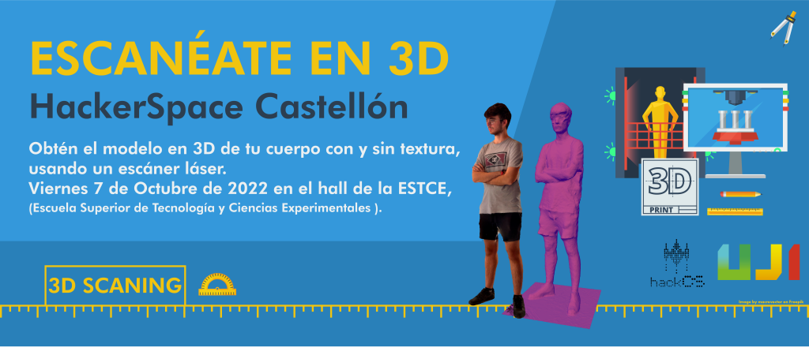

### 3D SCANNING DAY 2022

On Friday, October 7th, 2022, in the [ESTCE](https://www.google.es/maps/place/Escuela+Superior+de+Tecnologia+I+Ciencias+Experimentales,+Avenguda+Avenida+de+Vicente+Sos+Baynat,+12006+Castell%C3%B3n+de+la+Plana,+Castell%C3%B3n/@39.9926864,-0.0678504,19z/data=!3m1!4b1!4m5!3m4!1s0xd5ffe0f98be12e9:0x4e7634c2c3b978b7!8m2!3d39.9926854!4d-0.0673032?shorturl=1) hall, you will be able to scan yourself from head to toe, in color, capturing your unique and particular body shape. Additionally, during the Design, Creativity, and Technology Day on September 28th at the [ESTCE](https://www.google.es/maps/place/Escuela+Superior+de+Tecnologia+I+Ciencias+Experimentales,+Avenguda+Avenida+de+Vicente+Sos+Baynat,+12006+Castell%C3%B3n+de+la+Plana,+Castell%C3%B3n/@39.9926864,-0.0678504,19z/data=!3m1!4b1!4m5!3m4!1s0xd5ffe0f98be12e9:0x4e7634c2c3b978b7!8m2!3d39.9926854!4d-0.0673032?shorturl=1), there will be a raffle where you can win the 3D print of your figure.

 
