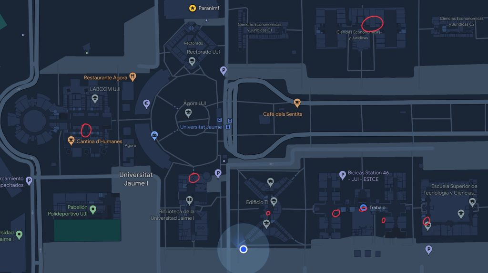

### IFIXIT REPAIR MANIFESTO  

Hackerspace Castellón has printed 10 posters of the [iFixit Repair Manifesto](https://es.ifixit.com/Manifesto), which have been distributed across the faculties of the [UJI](https://www.google.es/maps/place/Universitat+Jaume+I/@39.9902105,-0.0511631,14z/data=!4m6!3m5!1s0xd5ffe0fca9b5147:0x1368bf53b3a7fb3f!8m2!3d39.9943481!4d-0.0702147!16zL20vMDg0dGNk?coh=164777&entry=tt&shorturl=1). This initiative encourages students to choose products from environmentally responsible brands that facilitate device repair. Additionally, we urge students to demand their right to repair their devices and to fight against planned obsolescence.  

  
