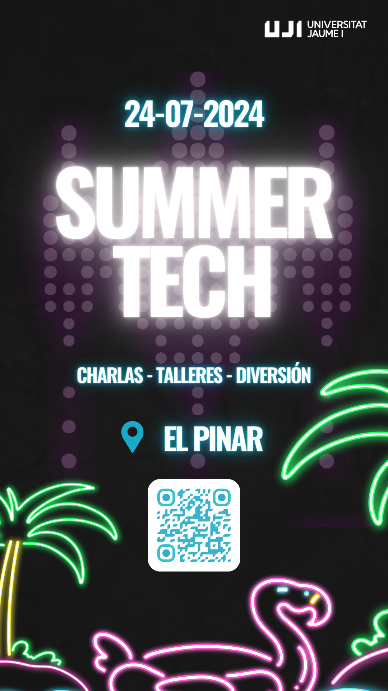

---  
title: "Summer Tech 2024"  
description: "On Wednesday, July 24, 2024, the 1st edition of SUMMER TECH will be held at El Pinar."  
pubDate: 2024-07-06  
categories:  
  - "agenda"  
---  

### SUMMER TECH 2024  

On Wednesday, July 24, 2024, the 1st edition of SUMMER TECH will be held at El Pinar.  

#### Information and Registration  

Date: **Wednesday 24/07**  

Location: [El Pinar](https://www.google.com/maps?client=ubuntu&hs=G6J&sca_esv=eddefdb7b92e7545&channel=fs&kgmid=/g/11bxg2l97q&shndl=30&shem=lcuae,uaasie&kgs=a881b2cbc5c48ba7&um=1&ie=UTF-8&fb=1&gl=pt&sa=X&geocode=KUmmJxf1_58SMYXc8woisREW&daddr=Av.+de+Ferrandis+Salvador,+10,+12100+Grau+de+Castell%C3%B3,+Castell%C3%B3,+Espa%C3%B1a)  

Join us at Summer Tech, an event with workshops and talks on technology and the open-source world. Enjoy a unique natural setting and food while learning and connecting with experts and enthusiasts. Reserve your spot and experience this unique event.

**IMPORTANT: You must bring your own chair.**  

Link to register (before July 20): https://forms.gle/Lj87TNpoWjVyXJ2G6  

  
