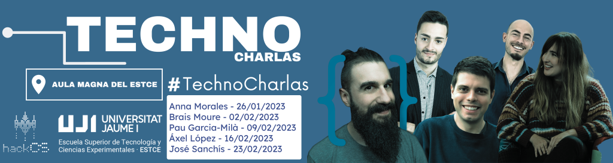

### TECHNOCHARLAS UJI 2023  

We have organized a series of expert talks on various topics, which can be attended both in person at the [Aula Magna](https://www.google.es/maps/place/Escuela+Superior+de+Tecnologia+I+Ciencias+Experimentales,+Avenguda+Avenida+de+Vicente+Sos+Baynat,+12006+Castell%C3%B3n+de+la+Plana,+Castell%C3%B3n,+Espa%C3%B1a/@39.9926198,-0.0676889,18z/data=!3m1!5s0xd5ffe0f98d8e357:0x79b3d77cb1bdb39f!4m6!3m5!1s0xd5ffe0f98be12e9:0x4e7634c2c3b978b7!8m2!3d39.9926854!4d-0.0673032!16s%2Fg%2F1hhx08l_l?entry=ttu&g_ep=EgoyMDI1MDMzMC4wIKXMDSoASAFQAw%3D%3D) of the [UJI](https://www.google.es/maps/place/Universitat+Jaume+I/@39.9902105,-0.0511631,14z/data=!4m6!3m5!1s0xd5ffe0fca9b5147:0x1368bf53b3a7fb3f!8m2!3d39.9943481!4d-0.0702147!16zL20vMDg0dGNk?coh=164777&entry=tt&shorturl=1) or virtually via a Google Meet link.

  

**[ONLINE ACCESS + INFO]** “Talking about Nanotechnology” - Anna Morales  
Date: **Thursday 26/11, 11:00h**  
Location: Virtual (live broadcast from the **Aula Magna of the ESTCE**):  
**https://meet.google.com/kgq-ymgx-ose**  
Expert: **Anna Morales** (University of Basel — Switzerland)  

The talk will last 45-60 min + ~30 min of open debate.  
Full attendance at the cycle counts for 0.5 credits for undergraduate students.  

About the speaker: Nanotechnologist and researcher at the University of Basel (Switzerland). She is also a science communicator via her YouTube channel, **SizeMatters**. Anna is a master's student in Materials Science and Engineering at the École Polytechnique Fédérale de Lausanne (EPFL), with a keen interest in materials science research, especially in electron microscopy.

**[ONLINE ACCESS + INFO]** “The Freelance Path” - Brais Moure  
Date: **Thursday 02/02, 11:00h**  
Location: [Aula Magna of the ESTCE]  
**https://meet.google.com/kgq-ymgx-ose**  
Expert: **Brais Moure** (Programmer and Communicator)  

The talk will last 45-60 min + ~30 min of open debate.  
Full attendance at the cycle counts for 0.5 credits for undergraduate students.  

About the speaker: Programmer and communicator, he has participated in TarugoConf22, PlatziConf, and other renowned conferences, as well as in a video at Apple's WWDC. He manages several apps and platforms we use every day, and his personal projects have over 2 million downloads.

**[ONLINE ACCESS + INFO]** “The Adventure of an Idea” - Pau Garcia-Milà  
Date: **Thursday 09/02, 11:30h**  
Location: Aula Magna of the ESTCE  
**https://meet.google.com/kgq-ymgx-ose**  
Expert: **Pau Garcia-Milà**  

The talk will last 45-60 min + ~30 min of open debate.  
Full attendance at the cycle counts for 0.5 credits for undergraduate students.  

About the speaker: Entrepreneur in the technology sector, winner of the Princess of Asturias award, a Cambridge University award, and other prizes from MIT, among others. He became famous when, at the age of 17, he sold his startup to Telefónica. His TikTok account "Te lo cuento en un minuto" has over a million followers.

**[ONLINE ACCESS + INFO]** “From Engineers to Social Entrepreneurs” - Áxel López  
Date: **Thursday 16/02, 11:00h**  
Location: Aula Magna of the ESTCE  
**https://meet.google.com/kgq-ymgx-ose**  
Expert: **Áxel López**  

The talk will last 45-60 min + ~30 min of open debate.  
Full attendance at the cycle counts for 0.5 credits for undergraduate students.  

About the speaker: Former UJI student and entrepreneur. Interested in the rural world and technology, he co-founded Voluta.coop, a company that brings modern technological solutions to rural areas. Winner of the entrepreneurship award from the Ministry for the Ecological Transition and Demographic Challenge, he now organizes hackathons and raises awareness among younger generations about the importance of the rural world.

**[ONLINE ACCESS + INFO]** “Talking about Blockchain” - José Sanchís  
Date: **Thursday 23/02, 11:00h**  
Location: Aula Magna of the ESTCE  
**https://meet.google.com/kgq-ymgx-ose**  
Expert: **José Sanchís**  

The talk will last 45-60 min + ~30 min of open debate.  
Full attendance at the cycle counts for 0.5 credits for undergraduate students.  

About the speaker: Co-founder of an IT services company, he is currently managing the publication of a rigorous yet engaging book on Bitcoin, as he believes the existing material is lacking in rigor. He has completed an open course at MIT on the engineering and design of cryptocurrencies (mainly focusing on Bitcoin).
