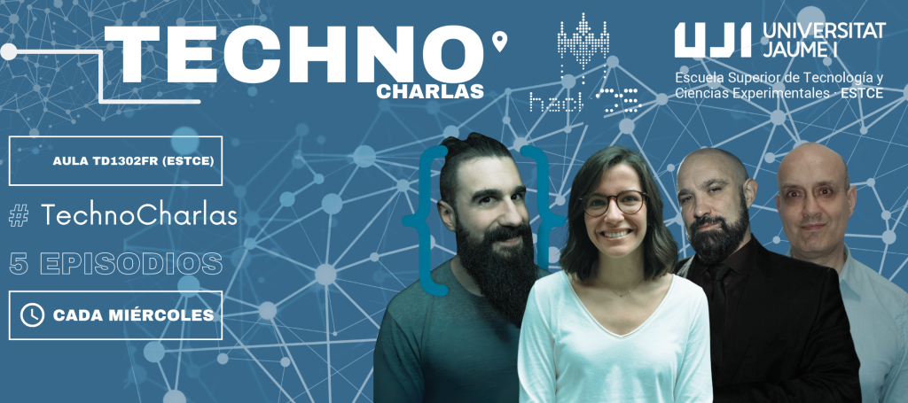

---  
title: "Technocharlas UJI 2024"  
description: "We have organized a series of expert talks on various topics, which can be attended both in person at the Aula TD1302FR (ESTCE) and virtually via a Google Meet link."  
pubDate: 2024-02-21  
categories:  
  - "agenda"  
---  

### TECHNOCHARLAS UJI 2024  

We have organized a series of expert talks on various topics, which can be attended both in person at the [Aula TD1302FR (ESTCE)](https://www.google.es/maps/place/TD0-301-CC,+12006+Castell%C3%B3n+de+la+Plana,+Castell%C3%B3n/@39.9926325,-0.0678082,19.42z/data=!3m1!5s0xd5ffe0f98fabe59:0x79b3d77c180eed05!4m5!3m4!1s0xd5ffe0f9f2933b5:0x47e8fe909104baff!8m2!3d39.9926435!4d-0.0674141?coh=164777&entry=tt&shorturl=1) or virtually via a Google Meet link.

  

**[ONLINE ACCESS + INFO]** “Female Entrepreneurship in the Tech Field” - Anna Cejudo - EP1  
Date: **Wednesday 21/02, 11:00h**  
Location: Virtual (live broadcast from the **Aula TD1302FR ESTCE**):  
**https://meet.google.com/thn-xpqb-bcn**  
Expert: **Anna Cejudo Mercado**  

The talk will last 45-60 min + ~30 min of open debate.  
Full attendance at the cycle counts for 0.5 credits for undergraduate students.  

About the speaker: A prominent entrepreneur and a leading figure in the field of Artificial Intelligence. Together with her partner, Pau García-Milà, she created Zeve, the first robot designed to engage in conversations, acting as a personalized educational guide.

**[ONLINE ACCESS + INFO]** “Talking about Cybersecurity” - Antonio Fernandes - EP2  
Date: **Wednesday 28/02, 11:00h**  
Location: In-person at the **Aula TD1302FR ESTCE**  
**https://meet.google.com/thn-xpqb-bcn**  
Expert: **Antonio Fernandes Vazquez**  

The talk will last 45-60 min + ~30 min of open debate.  
Full attendance at the cycle counts for 0.5 credits for undergraduate students.  

About the speaker: A Spanish hacker and cybersecurity expert with an extensive background in the field. He is known for his outreach, training, and expertise in information security. A recognized _Bug Hunter_, he has discovered and reported vulnerabilities in major companies such as Google, Facebook, Twitter, Uber, Microsoft, Intel, and Apple.

**[ONLINE ACCESS + INFO]** “13 Senior Tips I Would Give to My Junior Self” - Brais Moure - EP3  
Date: **Wednesday 13/03, 11:00h**  
Location: In-person at the **Aula TD1302FR ESTCE**  
**https://meet.google.com/thn-xpqb-bcn**  
Expert: **Brais Moure**  

The talk will last 45-60 min + ~30 min of open debate.  
Full attendance at the cycle counts for 0.5 credits for undergraduate students.  

About the speaker: Brais Moure, known as Mouredev, is a freelance software developer with over 12 years of experience. He specializes in iOS and Android applications and has created over 40 apps, both large and small-scale. In addition to his development work, Mouredev is an educational content creator with a YouTube channel boasting over half a million subscribers, where he teaches programming and app development.

**[ONLINE ACCESS + INFO]** “Talking about AI” - Ismael Sanz - EP4  
Date: **Wednesday 20/03, 11:00h**  
Location: In-person at the **Aula TD1302FR ESTCE**  
**https://meet.google.com/thn-xpqb-bcn**  
Expert: **Ismael Sanz**  

The talk will last 45-60 min + ~30 min of open debate.  
Full attendance at the cycle counts for 0.5 credits for undergraduate students.  

About the speaker: Associate Professor at the Department of Computer Engineering and Science at UJI. Previously, he worked in the private sector and at the Vrije Universiteit Brussel, Belgium. He is part of the TKBG research group, with interests in processing semi-structured and unstructured data, semantic technologies, and information retrieval. He has directed several research projects and contributed to high-impact international journals and conferences. He is also a co-founder of the tech company SemanticBots.

**[ONLINE ACCESS + INFO]** Round Table - EP5  
Date: **Wednesday 10/04, 11:00h**  
Location: In-person at the **Aula TD1302FR ESTCE**  
**https://meet.google.com/thn-xpqb-bcn**  
Experts:  
**Jose Bort** – CEO of Eventcase and President of Xarxatec.  
**Alexis Nadal** – CEO of Nayar Systems  
**Victor Rueda** – Deputy Director of the Industrial Engineering degree  
**Javier Gasch** – Head of Recruitment at Torrecid  

The main topic will revolve around entrepreneurship, science outreach, and activating the university community.

**[ONLINE ACCESS + INFO]** "Mars 2020 Perseverance: From Launch to Landing" - Fernando Abilleira - EP6  
Date: **Wednesday 08/05, 16:00h**  
Location: Virtual (live broadcast from the **Aula de Actos, ESTCE**):  
**https://meet.google.com/thn-xpqb-bcn**  
Expert: **Fernando Abilleira**  

The talk will last 45-60 min + ~30 min of open debate.  
Full attendance at the cycle counts for 0.5 credits for undergraduate students.  

About the speaker: Aerospace Engineer, he began his career at NASA's Goddard Space Flight Center in Greenbelt, Maryland (USA), where he supported mission analysis and design for the James Webb Space Telescope, Hubble Space Telescope, Solar Dynamics Observatory, and ST5, among others. In 2004, he started working at NASA's Jet Propulsion Laboratory in Pasadena, California, as a Trajectory Analyst and Mission Design Engineer for the Mars Exploration Program. Fernando provided technical support for multiple missions and studies, including the Mars Telecommunications Orbiter, Mars Science Orbiter, Mars Netlanders, and Mars Sample Return. He was the deputy operations manager for the Mars 2020 Perseverance rover mission, from launch to successful landing in the Jezero Crater on Mars on February 18, 2021. Currently, Fernando is supporting the ExoMars Rosalind Franklin project by ESA/NASA as Mission Design Director.
