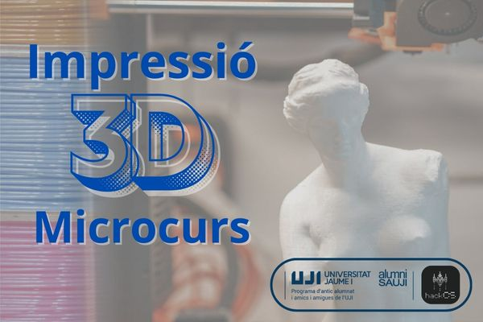

## **Microcourse: "3D Printing: Slicing with Prusa Slicer and Parametric Modeling with Onshape"**  

  

## <a href="https://drive.google.com/uc?export=download&id=1mlRjIqN3Ekz0S_hKNkAyMb6zL-g_hNtw">**LINK TO PRESENTATION (PDF)**</a>  

## <a href="https://drive.google.com/uc?export=download&id=1mo-i57dWZJebl93xp9KAShWu8m0BywMb">**LINK TO PRESENTATION 2 (PDF)**</a>  

## <a href="https://drive.google.com/uc?export=download&id=1qPdpedg98qHknJdK3PokTFnIpCuVHcyJ">**LINK TO PRESENTATION 3 (PDF)**</a>  

<figure>  

  

<figcaption>  

Design Rules for 3D Printing  

</figcaption>  

</figure>  
