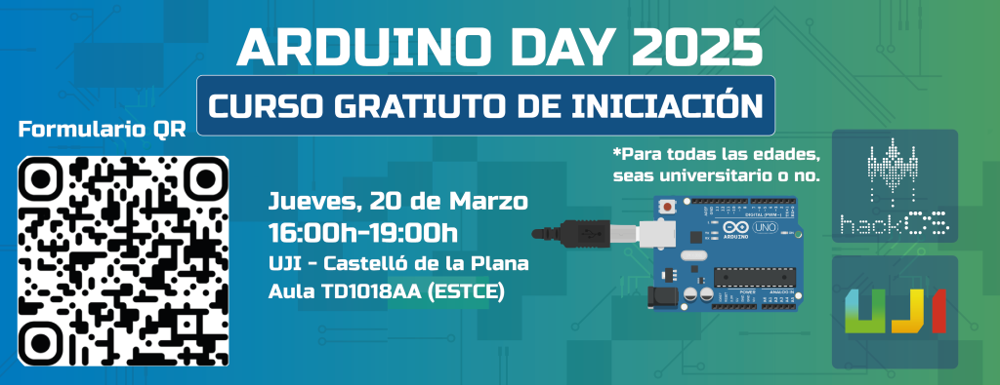

### ARDUINO DAY 2025

Celebraremos el [Arduino Day](https://days.arduino.cc/about) realizando un curso de iniciación gratuito el Jueves 20 de Marzo de 2025.

  
<strong>INFORMACIÓN E INSCRIPCIÓN AL CURSO</strong>

  Fecha: **jueves 20/03**

  Lugar: [UJI](https://www.google.es/maps/place/Universitat+Jaume+I/@39.9902105,-0.0511631,14z/data=!4m6!3m5!1s0xd5ffe0fca9b5147:0x1368bf53b3a7fb3f!8m2!3d39.9943481!4d-0.0702147!16zL20vMDg0dGNk?coh=164777&entry=tt&shorturl=1)

  En el curso se enseñará la estructura básica del Arduino, el uso de sus pines GPIO y de los pines analógicos. Asimismo, se realizarán proyectos de forma práctica para experimentar cómo funciona el Arduino.

  Se hará en el **Aula TD1018AA** de **16-19h**. 

**IMPORTANTE: Es necesario traer ordenador portátil con el Arduino IDE instalado.**

  
Link para inscribirse: https://forms.gle/fayBGnjUVXNkvHoZ8 

  
<strong>ENALCE A LA PRESENTACIÓN</strong>

