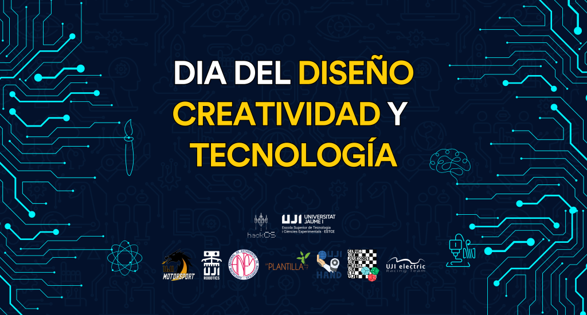

### DÍA DEL DISEÑO, CREATIVIDAD Y TECNOLOGÍA 2023

El jueves 28 de Septiembre de 2023 en el hall de la [ESTCE](https://www.google.es/maps/place/Escuela+Superior+de+Tecnologia+I+Ciencias+Experimentales,+Avenguda+Avenida+de+Vicente+Sos+Baynat,+12006+Castell%C3%B3n+de+la+Plana,+Castell%C3%B3n/@39.9926864,-0.0678504,19z/data=!3m1!4b1!4m5!3m4!1s0xd5ffe0f98be12e9:0x4e7634c2c3b978b7!8m2!3d39.9926854!4d-0.0673032?shorturl=1) se celebrará la 6ª edición del Día del Diseño, Creatividad y Tecnología de la [ESTCE](https://www.google.es/maps/place/Escuela+Superior+de+Tecnologia+I+Ciencias+Experimentales,+Avenguda+Avenida+de+Vicente+Sos+Baynat,+12006+Castell%C3%B3n+de+la+Plana,+Castell%C3%B3n/@39.9926864,-0.0678504,19z/data=!3m1!4b1!4m5!3m4!1s0xd5ffe0f98be12e9:0x4e7634c2c3b978b7!8m2!3d39.9926854!4d-0.0673032?shorturl=1), allí podrás participar en las diversas actividades que las asociaciones de la [UJI](https://www.google.es/maps/place/Universitat+Jaume+I/@39.9902105,-0.0511631,14z/data=!4m6!3m5!1s0xd5ffe0fca9b5147:0x1368bf53b3a7fb3f!8m2!3d39.9943481!4d-0.0702147!16zL20vMDg0dGNk?coh=164777&entry=tt&shorturl=1) ofrecen y participar en un sorteo.

    Términos y Condiciones Legales del Sorteo​

Los Términos y Condiciones Especiales y éstos Términos y Condiciones Generales constituyen conjuntamente los Términos y Condiciones de la Promoción (“Términos y Condiciones de la Promoción”). En caso de conflicto entre estos Términos y Condiciones Generales y los Términos y Condiciones Especiales prevalecerán los Términos y Condiciones Especiales.

La Promoción está abierta para que participen en ella todas las Personas Incluidas según se especifica en los Términos y Condiciones Especiales (en adelante los “Participantes”).

No podrán participar las Personas Excluidas (según se define en los Términos y Condiciones Especiales), los miembros de las asociaciones organizadoras, sus agentes o cualquier tercero directamente relacionado con la gestión de la Promoción. El Responsable se reserva todos los derechos para solicitar la información o documentación necesaria para verificar que los Participantes cumplan con todas las condiciones necesarias para ser considerado una Persona Incluida.  
La promoción es de carácter gratuito no siendo necesaria la compra o pago de importe alguno para la participación.

Solo se permite una participación por persona. Sólo las personas físicas son aptas para participar. Las personas residentes en el Norte de Irlanda, Hong Kong, la Estrella de la muerte, hogsmade o la C137 así como cualquier otra Persona Excluida, no podrán participar en la Promoción. Sólo se aceptarán las participaciones enviadas a través del método oficial designado para el registro en la Promoción. El Responsable no aceptará participaciones que (a) sean generadas automáticamente por ordenador o cualquier otro sistema; (b) sean completadas por terceros o de forma masiva; o (c) sean ilegibles, incompletas, fraudulentas, alteradas, reconstruidas, falsificadas o manipuladas.

El Responsable se reserva el derecho, a su entera discreción, de descalificar al Participante cuya actuación o conducta se contraria al espíritu o la intención de la Promoción o de estos Términos y Condiciones de la Promoción, a su entera discreción.  
La Fecha de Inicio y la de Finalización para formalizar la participación son la hora del inicio del evento y la hora del final del evento respectivamente. Las participaciones recibidas después de la hora de Finalización no serán tenidas en cuenta.

Los Participantes se comprometen a proporcionar información veraz y precisa. El Responsable no tendrá responsabilidad alguna en relación con participaciones perdidas, extraviadas, dañadas, borradas, incompletas, ilegibles o de otro modo imposibles de leer o retrasadas en la entrega, independientemente de la causa, incluyendo, por ejemplo, como resultado de cualquier fallo postal, fallo del equipo técnico, mal funcionamiento de equipos, sistemas, satélite, red, servidor, hardware informático o fallo del software de cualquier tipo. El Responsable no acepta responsabilidad alguna por las participaciones que no se hayan completado con éxito debido a un fallo técnica, un fallo del hardware o software del ordenador, un fallo del servidor, de la red o del satélite de cualquier tipo o debido a errores de entrada de datos u omisiones en una participación hecha por los Participantes. Los Participantes aceptan que, en el caso de un problema técnico en el sistema del Responsable, las participaciones pueden no estar disponibles temporalmente y, si éstas se han visto afectadas, es posible que los Participantes deban volver a ingresar su información para que su participación sea válida.

La prueba de publicación o transmisión no constituye prueba de la participación o recibo por parte del Responsable de ninguna solicitud de participación.  
Un ganador, o varios ganadores, serán elegidos por el método de selección y de acuerdo con los criterios de selección aplicables y en la fecha indicada en los Términos y Condiciones Especiales.  
El (los) ganador (es) recibirán el (los) premio (s) indicado(s) en los respectivos anuncios del sorteo.  
El (los) ganador(es) serán notificados a través del método y en la fecha indicada en los Términos y Condiciones Especiales. El Responsable puede solicitar más información al ganador para confirmar que es una Persona Incluida y organizar la entrega del premio.  
En el caso de que un ganador no responda en el plazo indicado en los Términos y Condiciones Especiales, el Responsable se reserva el derecho de seleccionar otro ganador y otorgarle el (los) premio(s) o de dejar el (los) premio(s) desierto(s).

El Responsable se reserva el derecho de seleccionar premios alternativos de valor equivalente o similar, sin previo aviso si el premio no estuviera disponible por cualquier motivo.  
El ganador(es) es responsable de proporcionar la información de contacto completa y precisa al Responsable, y el Responsable quedará eximido de responsabilidad cuando el ganador no haya recibido el (los) premio(s) debido a que proporcionó información de contacto incorrecta o incompleta.

El premio no es intercambiable, no es transferible y no se ofrece un pago alternativo en efectivo.  
La decisión del Responsable con respecto a cualquier aspecto de la Promoción es definitiva y vinculante y no se entrará en discusión o negociación alguna al respecto.

Se considera que los Participantes han aceptado y acuerdan estar sujetos a los Términos y Condiciones de la Promoción en el momento de la inscripción. El Responsable se reserva el derecho de denegar la participación o la entrega del premio a cualquier persona que incumpla los Términos y Condiciones de la Promoción.  
El premio no incluye seguro de viaje, el coste del viaje hacia y desde el lugar del evento, comidas y bebidas, gastos, impuestos o gastos personales, a menos que se indique expresamente lo contrario en los Términos y Condiciones Especiales. El ganador es responsable de cualquier obligación de declarar el premio a las autoridades fiscales pertinentes y de remitir, aceptar o pagar cualquier impuesto, tasa, retención y/o gasto de cualquier tipo, que en virtud de la aplicación de la normativa fiscal pudieran ser aplicables, quedando el Responsable eximido de responsabilidad alguna en este sentido y no teniendo obligación alguna de proporcionar asesoramiento fiscal. Cualquier otro coste en el que se incurra, además de los mencionados anteriormente y que sean incidentales al cumplimiento del premio, es responsabilidad del ganador (es).

El Responsable se reserva el derecho de anular, cancelar, suspender o modificar la Promoción cuando sea necesario a su entera discreción.  
En la medida en que lo permita la ley aplicable, el Responsable, sus agentes o distribuidores no tendrá obligación alguna de compensar al (los) Ganador (es) bajo ninguna circunstancia ni de aceptar ninguna responsabilidad por cualquier pérdida, o daño que ocurra como un resultado de aceptar o utilizar el premio. Sin perjuicio de lo anterior, nada de lo dispuesto en los Términos y Condiciones de la Promoción puede excluir o limitar la responsabilidad del Responsable en los supuestos de lesión personal o muerte, cuando sean causados por negligencia del Responsable, sus agentes o distribuidores o el de sus empleados. Los derechos imperativos de los Participantes no se ven afectados por esta disposición.

Al ingresar a la Promoción, los Participantes confirman que son aptos para ello y que igualmente son aptos para recibir el premio. El Responsable puede requerir que los Participantes proporcionen pruebas de que tienen la condición de Personas Incluidas para participar en la Promoción. Si se determina que el ganador no es apto, el Responsable se reserva el derecho de otorgar el premio a otro Participante y solicitar la devolución de cualquier premio ya otorgado. El Responsable no aceptará ninguna responsabilidad por cualquier reclamación o daño causado directa o indirectamente por el hecho de que un Participante no haya verificado su aptitud o la capacidad de recibir o disfrutar del premio antes de formalizar su participación en la Promoción.

Al participar en la Promoción, los Participantes acuerdan que el premio se otorga “tal cual”, y que ni el Responsable ni ninguna de sus compañías subsidiarias o pertenecientes a su grupo de empresas hacen ninguna manifestación o garantía de ninguna naturaleza con respecto al premio.

En las Promociones que requieren que los Participantes envíen imágenes, videos u otros medios, los Participantes confirman que:

- Las imágenes y otras presentaciones son trabajos originales, no son difamatorias o calumniosas y que no infringen los derechos de terceros  
    ● No existen acuerdos que entren en colisión y que puedan restringir el uso de estas imágenes u otras presentaciones.  
    ● Tienen el consentimiento para usar cualquier imagen de terceros en la participación y se ha renunciado a los derechos a tal efecto para ese uso. Si la imagen de un tercero es de una persona menor de 18 años, se debe proporcionar el consentimiento de los padres o tutores  
    ● El Participante presentará evidencia de cualquier consentimiento o autorización requerida a solicitud del Responsable, o correrá el riesgo de ser descalificado para ingresar a la Promoción.

El Responsable no reclama ningún derecho de propiedad o titularidad sobre su participación.  
Los Participantes acuerdan que el Responsable puede, aunque no esté obligado a ello, hacer que la participación esté disponible en sus sitios web y en cualquier otro medio, ya sea conocido o inventado en el futuro, y en relación con cualquier tipo de publicidad de la Promoción. Los Participantes acuerdan otorgar al Responsable una licencia irrevocable, no exclusiva, libre de royalties, en todo el mundo, por el período completo de cualquier derecho de propiedad intelectual en la participación a la promoción y cualquier material que lo acompañe, para usar, mostrar, publicar, transmitir, copiar, editar, alterar, almacenar, alterar y sub-licenciar la participación en la Promoción y cualquier material que lo acompañe (incluidas las imágenes) para tales fines.

Los ganadores aceptan que el Responsable puede usar su nombre, imagen y ciudad o país de residencia para anunciar al ganador de esta promoción y para cualquier otro propósito promocional razonable y sin contraprestación o pago alguno. En este sentido, los Participantes acuerdan colaborar plenamente con el Responsable en el desarrollo de dichas actividades promocionales.

El Responsable recabará y tratará la información personal de los Participantes y podrá compartirla con los agentes y empresas de su grupo del Responsable (incluidos los que se encuentran fuera del Espacio Económico Europeo) en la medida necesaria para poder desarrollar la Promoción, incluida en su caso la entrega del premio al Ganador. Si los Participantes no proporcionan la información obligatoria solicitada al ingresar y participar en la Promoción, no podrán participar en la misma. El Responsable recabará y tratará los nombres de los Participantes y otros datos personales derivados de su participación en la Promoción, que se utilizarán de acuerdo con la Política de Privacidad vigente en cada momento, según se indica en los Términos y Condiciones Especiales.

Los datos personales suministrados durante el curso de esta Promoción se pueden transmitir a terceros proveedores solo en la medida en que se requiera para el cumplimiento, entrega o gestión de los premios.  
La promoción se regirá por la ley de la jurisdicción mencionada en los Términos y Condiciones Especiales y los Participantes de la Promoción se someterán a la jurisdicción de los tribunales de la jurisdicción mencionados en los Términos y Condiciones Especiales.  
El Responsable es la entidad especificada en los Términos y Condiciones Especiales.

La Promoción no está patrocinada, respaldada o administrada de ninguna manera por, o asociada con cualquier sitio web de terceros o plataformas de medios sociales enumerados en los Términos y Condiciones Especiales. El Responsable se exime de toda responsabilidad derivada del uso de sitios webs de terceros o redes sociales por parte del(os) Participante(s).

Términos y Condiciones Especiales:

- Método de selección del ganador: Aleatorio mediante una página web similar a random.org
- Plazo previsto para la selección del ganador: 10 días hábiles desde la finalización de la recogida de participaciones.
- Método de notificación del ganador: Correo electrónico.
- Plazo previsto para la notificación del ganador: 12 días hábiles desde la finalización de la recogida de participaciones.
- Plazo límite para la respuesta a la notificación del ganador: 10 días hábiles desde la fecha de la notificación del ganador.
