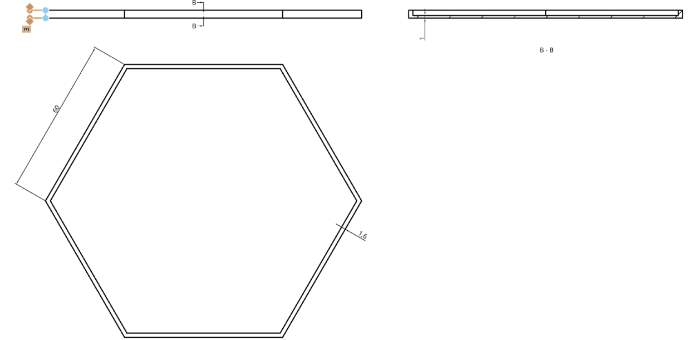

import { Image } from "astro:assets";
import exemple1 from "./images/hexencadis-exemple-1.png";
import exemple2 from "./images/hexencadis-exemple-2.png";
import exemple3 from "./images/hexencadis-exemple-3.png";
import exemple4 from "./images/hexencadis-exemple-4.png";

### Introducción

Proyecto organizado por HackerSpace Castellón y La Plantilla Disseny, en colaboración con la Escuela Superior de Tecnología y Ciencias Experimentales (ESTCE).

El presente proyecto tiene como finalidad generar una instalación colectiva modular representativa de la comunidad universitaria mediante el diseño y fabricación de teselas hexagonales impresas en 3D.

Se busca:

- Promover el diseño junto con la innovación técnica de la impresión 3D.
- Fomentar la originalidad en el ámbito del modelado de piezas.
- Concienciar sobre la responsabilidad ética en el diseño.

Este proyecto está basado en el [Proyecto 100 Hex](https://tecnoloxia.org/100hex/o-proxecto-100hex/).

### Tesela

La tesela tendrá unas medidas estándar para poder realizar correctamente el mural:

La tesela es un hexágono regular de 60mm de lado y un espesor de 1mm. Tiene un marco de 1,6mm de grosor y una altura de 2mm.

- Las modificaciones se tienen que realizar dentro del espacio de 2mm que deja el marco.
- El hexágono en ningún momento podrá estar agujereado, debido a que la cara trasera se usará para pegarla al mural.
- El hexágono no podrá tener un espesor mayor a 3mm.
- El hexágono se fabricará usando una máquina FDM (impresión 3D). El primer milímetro se fabricará de uno de los cuatro colores que se usarán (rojo, amarillo, verde y azul), mientras que los dos últimos milímetros se fabricarán en blanco.
- El hexágono tiene que poder fabricarse en una sola pieza.

Dejamos el enlace para descargar la tesela para que podáis usarla de plantilla:

[Solidworks](https://drive.google.com/file/d/1CuRjqLo4hz-RLx6QtfcCneM30Dw6Ua0x/view?usp=sharing) · [STEP](https://drive.google.com/file/d/1P1ErDl4eBr83zpLyyesYuNlKnDZ3kJWp/view?usp=drive_link) · [STL](https://drive.google.com/file/d/1tldZ-8MZmAhzy6PDAwlT2m-cE5cbAlHW/view?usp=sharing)

### Ejemplos

  

    <Image src={exemple1} alt="Ejemplo de tesela con patrón de rayos azules" style="width:100%; height:100%; object-fit:contain;" />
  

  

    <Image src={exemple2} alt="Ejemplo de tesela con espiral verde" style="width:100%; height:100%; object-fit:contain;" />
  

  

    <Image src={exemple3} alt="Ejemplo de tesela con flor de la vida dorada" style="width:100%; height:100%; object-fit:contain;" />
  

  

    <Image src={exemple4} alt="Ejemplo de tesela con escaleras rojas y grises" style="width:100%; height:100%; object-fit:contain;" />
  

### Normativa

#### 1. Participantes

Podrán participar estudiantes matriculados en la ESTCE, conforme a las condiciones establecidas por las asociaciones.

#### 3. Especificaciones de la tesela

La tesela deberá cumplir estrictamente con las siguientes especificaciones:

- Cumplir con la forma y dimensiones que se muestran en el croquis y plantilla proporcionados por las asociaciones.
- No tener ninguna modificación en el perímetro exterior con tal de asegurar la correcta disposición modular con el resto de teselas.
- Que el diseño sea completamente original.

#### 4. Contenido y criterios éticos

Queda estrictamente prohibido incluir en el diseño:

- Contenido ofensivo, violento, discriminatorio o explícito.
- Referencias a drogas o actividades ilegales.
- Contenido político partidista.
- Mensajes de odio o simbología sensible.
- QRs.
- Uso no autorizado de propiedad intelectual protegida.

La organización se reserva el derecho de excluir cualquier diseño que considere inapropiado o contrario a los valores académicos y de convivencia.

### Fechas e inscripción

El plazo para participar finaliza el **31 de enero de 2027**.

Para participar solo hace falta enviar vuestro diseño a través de un formulario: la impresión 3D de la pieza la hace la organización, los participantes solo se encargan del diseño.

[PENDIENTE: enlace al Google Forms de inscripción]

### Concurso

Para fomentar la participación en el proyecto, se realizará un concurso para premiar a la mejor tesela de las que participen. Las teselas serán valoradas por un jurado formado por miembros de ambas asociaciones. Los miembros de las asociaciones podrán participar con sus teselas para el mural, pero no podrán optar a premio.

El premio será una Bambu Lab A1 Mini.
