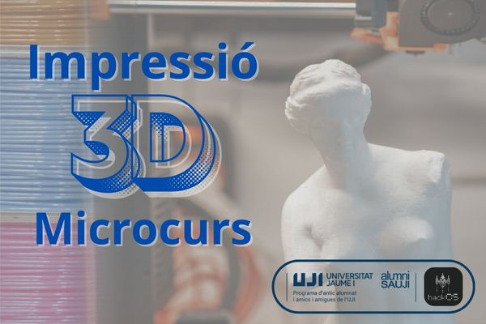

## **Microcurso: "Impresión 3D: Laminado con Prusa Slicer y modelado paramétrico con Onshape"**

## <a href="https://drive.google.com/uc?export=download&id=1mlRjIqN3Ekz0S_hKNkAyMb6zL-g_hNtw">**ENLACE A LA PRESENTACIÓN (PDF)**</a>

## <a href="https://drive.google.com/uc?export=download&id=1mo-i57dWZJebl93xp9KAShWu8m0BywMb">**ENLACE A LA PRESENTACIÓN 2 (PDF)**</a>

## <a href="https://drive.google.com/uc?export=download&id=1qPdpedg98qHknJdK3PokTFnIpCuVHcyJ">**ENLACE A LA PRESENTACIÓN 3 (PDF)**</a>

<figure>

<figcaption>

Reglas de Diseño para la Impresión 3D

</figcaption>

</figure>
